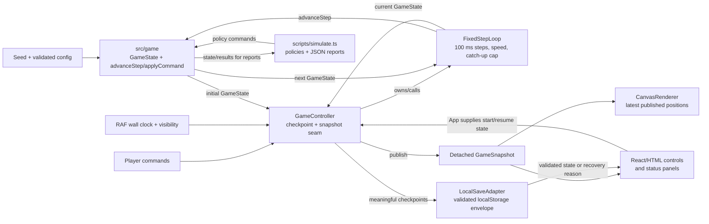

# Untitled Island architecture

This guide is for contributors changing game rules, runtime integration, or
presentation. Untitled Island is a browser survival game in which three
autonomous survivors wait 14 in-game days for rescue. The player controls the
pace, selects at most one camp priority per day, and resolves events when the
simulation pauses. The game has no backend, cloud save, or telemetry service.

## Goals and principles

- Keep the authoritative game state deterministic, serializable, and independent
  of browser APIs. A seed, validated configuration, rules version, and command
  sequence should be sufficient to reproduce a core run.
- Keep mutable concerns behind explicit seams: wall-clock scheduling,
  visibility, storage, and rendering are adapters around the game core.
- Make autonomous behavior inspectable. Tasks carry reason codes, reservations
  prevent over-claiming finite sources, events record participants and choice
  provenance, and ending summaries are derived from state without mutating it.
- Treat production content and the shortened developer slice as separate,
  validated contracts. Do not use the slice to make production balance or
  release claims.

## System shape

The browser path and headless path use the same `src/game` state transitions.
`GameController` owns the browser lifecycle; `FixedStepLoop` converts elapsed
wall time into bounded fixed steps. See [`src/game/simulation.ts`](../src/game/simulation.ts#L978-L1134),
[`src/runtime/fixedStepLoop.ts`](../src/runtime/fixedStepLoop.ts#L25-L130), and
[`src/runtime/GameController.ts`](../src/runtime/GameController.ts#L53-L125).

## The deterministic game core (`src/game`)

`GameState` is the authoritative, plain-data state. It contains the integer
clock, validated config, island sources, shared resources, shelter, survivors,
active tasks and reservations, events and scheduled effects, history and
turning points, planner state, metrics, camp policy, and all random stream
states. `createSnapshot` and `cloneGameState` return detached copies, so a
consumer cannot mutate the simulation by changing a published snapshot. The
public exports are collected by [`src/game/index.ts`](../src/game/index.ts).

The core entry points are:

- `createGame` validates either the production or slice configuration, derives
  independent random streams, creates survivors and island cosmetics, and
  plans initial tasks.
- `advanceStep` copies the state and advances exactly one authoritative tick.
  It handles day boundaries and renewable-source replenishment, shelter decay,
  hunger/thirst/energy and morale, injury recovery, hard-need interruptions,
  autonomous planning, travel/work progress, reservation invalidation, delayed
  effects, deaths, rescue, and event activation.
- `applyCommand` validates and applies player-facing commands. Priority changes
  are accepted only while running and only once per day. Event choices validate
  the active event and resource costs atomically; acknowledgement resumes the
  run; reset creates a fresh seeded state. Rejected commands return the
  unchanged state with a reason.

The fixed island geometry is authored in [`src/game/island.ts`](../src/game/island.ts#L4-L57):
six waypoints and explicit routes connect camp, water, forage, wreckage, forest,
and the interior. Gathering and repair tasks reserve expected source yield or
materials before work starts. Completion consumes the reservation and clamps
resources to configured caps; invalidated reservations are released.

### Autonomous planning, events, and endings

For each living survivor, hard constraints take precedence: critical thirst,
critical hunger, critical health, critical energy, and night sleep can interrupt
ordinary work. Otherwise the planner scores water, food, materials, shelter
repair, and rest against shared stock, shelter condition, and the selected camp
priority. Ties are ordered by task kind; `plannerRotation` rotates the first
planning opportunity across survivors. This is deterministic and inspectable in
[`src/game/simulation.ts`](../src/game/simulation.ts#L346-L484).

The event scheduler selects eligible authored templates by phase, cooldown,
resource, participant, and prior-choice constraints. Production has weighted
root events, queued follow-ups, and a decision cap; choosing an event can apply
immediate effects, schedule a delayed effect, and queue a linked follow-up.
Interactive decisions set `status` to `decision`; the result remains visible as
`event-result` until an acknowledgement command. Definitions and the mode
registry live in [`src/game/events.ts`](../src/game/events.ts#L16-L113), while
selection and effect handling live in
[`src/game/simulation.ts`](../src/game/simulation.ts#L657-L965).

At rescue, a run with at least one living survivor is a victory; if all
survivors die it is a defeat. The derived quality is `triumphant-rescue` when
everyone survives with average health at least 65, average morale at least 45,
and shelter at least 45; otherwise it can be `costly-rescue`, `barely-alive`,
or `lost-expedition`. [`src/game/endings.ts`](../src/game/endings.ts#L1-L43)
derives this report without changing state.

### Randomness and conditional determinism

The core uses a serializable Mulberry32 source seeded by a hash of the run seed
and stream label. `GameState.rngStates` contains five independent streams:

| Stream               | Current responsibility                                             |
| -------------------- | ------------------------------------------------------------------ |
| `survivorGeneration` | Names, visual variants, and trait pairs at creation                |
| `islandCosmetics`    | The authored island’s cosmetic variant                             |
| `behavior`           | Advanced once per simulation step; reserved for behavior variation |
| `eventSelection`     | Weighted event-template selection                                  |
| `eventOutcome`       | Probabilistic event effects                                        |

The behavior stream is advanced, but the planner’s choices and tie-breaks are
deterministic; behavior RNG does not currently drive AI planning. The stream
implementation and labels are in [`src/game/random.ts`](../src/game/random.ts#L3-L117),
and the per-step/outcome draws are visible in
[`src/game/simulation.ts`](../src/game/simulation.ts#L1028-L1034) and
[`src/game/simulation.ts`](../src/game/simulation.ts#L1157-L1166).

“Same seed, same run” is conditional: the same seed, mode/config, rules
version, command sequence, and effective event registry produce the same core
state and stream positions. Browser timing, visibility interruptions, and the
catch-up cap can change how many fixed steps have occurred, so wall-clock runs
are reproducible only when their resulting steps and commands match. Headless
policies have separate policy-owned deterministic streams and are part of the
command sequence, not the core game RNG.

## Runtime boundary

`FixedStepLoop` defaults to a 100 ms step and supports speeds `0x`, `1x`, `3x`,
and `8x`. It scales elapsed time by speed, advances at most eight catch-up
steps per frame, and drops excess whole steps after the cap while retaining
only a fractional remainder. Pausing, zero speed, a non-running game status,
or a terminal step stops advancement.

`GameController` supplies browser `requestAnimationFrame` and document
visibility adapters. A hidden tab pauses the loop, checkpoints the current
snapshot, resets the accumulator on return, and does not catch up hidden wall
time. Event decision/result states also stop simulation until commands resolve
them. Snapshots are published at a configurable cadence (8 Hz by default),
with immediate publication at boundaries; the checkpoint callback is the seam
used by persistence. The controller also reports local wall-clock timing by
speed, manual pause, hidden time, and decision time.

The controller exposes an interpolation alpha for future consumers, but the
current Canvas path does not use active interpolation. `CanvasRenderer` draws
the `position` from the latest published snapshot. It does not interpolate
between `previousPosition` and `position`; its map, routes, markers, cosmetic
variant, and phase lighting are presentation of that snapshot. React’s
`CanvasView` redraws the latest snapshot on animation frames while HTML panels
remain the accessible source for survivor details and controls. See
[`src/rendering/CanvasRenderer.ts`](../src/rendering/CanvasRenderer.ts#L285-L406)
and [`src/App.tsx`](../src/App.tsx#L302-L345).

## Presentation-time formatting

Integer ticks remain authoritative. [`src/presentation/gameTime.ts`](../src/presentation/gameTime.ts#L1-L99)
converts them to player-facing day/time strings (tick zero is dawn at 6:00 AM),
rounded durations, and remaining hunger/thirst percentages. Formatting clamps
to the configured rescue range and keeps ticks out of normal player-facing
labels. Keep these conversions in presentation helpers rather than changing
core state to store display values.

## Local guarded persistence

`LocalSaveAdapter` is the only browser-storage boundary. It serializes a cloned
state in a version-1 envelope containing `schemaVersion`, `rulesVersion`,
`savedAt`, and `gameState`; the payload is limited to 512 KiB by UTF-8 byte
length. `parseSaveEnvelope` validates config, status, clock, resources,
survivors, task/reservation links, event provenance, histories, metrics, and all
five RNG streams before returning another detached state. It never repairs an
invalid payload. Current rules mismatch, schema mismatch, malformed JSON,
oversized data, and storage failures are explicit failure reasons.

Production uses `untitled-island:resume`; the developer slice uses a separate
`untitled-island:internal-slice` key. The App checkpoints through
`GameController.onCheckpoint` at start, commands, day/boundary transitions,
terminal state, and visibility changes. Storage errors are non-fatal to the
running game. If a production save is invalid or incompatible, the player is
shown the reason and must discard it or start a fresh run; there is no automatic
repair. Saves are local-only: there is no backend, cloud sync, account service,
or telemetry path. See [`src/persistence/saveSchema.ts`](../src/persistence/saveSchema.ts#L19-L45)
and [`src/persistence/localSave.ts`](../src/persistence/localSave.ts#L42-L91).

## Production and developer-only slice

Both modes are deliberately validated; mixing their dimensions is rejected by
`validateGameConfig`.

| Contract       | Production                                    | Internal slice                                        |
| -------------- | --------------------------------------------- | ----------------------------------------------------- |
| Mode           | `production`                                  | `slice`                                               |
| Survivors      | 3                                             | 1                                                     |
| Ticks per day  | 600                                           | 120                                                   |
| Rescue tick    | 8,400 (14 days)                               | 360 (3 days)                                          |
| Event registry | 13 production templates, including follow-ups | 3 stable slice templates                              |
| Browser entry  | Default                                       | `?mode=slice`; test/developer path, not player-facing |
| Save key       | `untitled-island:resume`                      | `untitled-island:internal-slice`                      |

The contracts and balance version are centralized in
[`src/game/tuning.ts`](../src/game/tuning.ts#L1-L117). Production and slice
economy rates are intentionally separate.

## Headless simulation, tests, and CI

[`scripts/simulate.ts`](../scripts/simulate.ts#L686-L797) drives the same core
with three named policies: `conservative`, `resource-greedy`, and
`random-fuzz`. It supports a single run, the `matrix` batch, the checked-in
`release` batch, and leave-one-event-template-out `sensitivity` runs. Reports
are machine-readable JSON containing seeds, policy IDs/versions, mode, status,
ending quality, event and decision metrics, task reasons, priorities, deaths,
resource/source minima, invariant failures, and command traces where retained.
The policy implementation and separate policy seed are in
[`scripts/simulation/policies.ts`](../scripts/simulation/policies.ts#L12-L143).

The release manifest expands and hashes 10,000 fixed seeds in
[`scripts/manifests/m5-release-v1.json`](../scripts/manifests/m5-release-v1.json);
[`scripts/simulation/manifest.ts`](../scripts/simulation/manifest.ts#L4-L32)
checks its count, uniqueness, endpoints, and SHA-256. Full release and
sensitivity batches are manual or scheduled and expensive. Pull-request CI’s
`simulate:ci` run is intentionally only the matrix policies against one seed
(`ci`); it is not the full 10,000-seed batch.

Vitest covers core determinism, planning/economy, events, time formatting,
persistence validation, and runtime lifecycle in [`src/test`](../src/test).
Playwright covers the browser slices in [`e2e`](../e2e), including setup,
production and slice flows, presentation, saves, visibility, keyboard, and
mobile-sized layouts. GitHub Actions runs Node 24 typecheck, lint, Prettier
format checking, unit tests, production build, the one-seed deterministic
simulation matrix, and the short Chromium suite (Desktop Chrome and emulated
Pixel 7). It does not claim Firefox, WebKit/Safari, or physical-device
coverage. See [`.github/workflows/ci.yml`](../.github/workflows/ci.yml#L14-L72).

## Repository and module map

| Path                                                                | Ownership and contract                                                         |
| ------------------------------------------------------------------- | ------------------------------------------------------------------------------ |
| [`src/game`](../src/game)                                           | Pure state, commands, tuning, routes, traits, events, RNG, simulation, endings |
| [`src/runtime`](../src/runtime)                                     | Fixed-step loop and browser lifecycle/checkpoint seam                          |
| [`src/rendering`](../src/rendering)                                 | Read-only Canvas map and survivor drawing                                      |
| [`src/presentation`](../src/presentation)                           | Tick/duration/need display formatting                                          |
| [`src/persistence`](../src/persistence)                             | Versioned envelope and guarded localStorage adapter                            |
| [`src/App.tsx`](../src/App.tsx) / [`src/main.tsx`](../src/main.tsx) | React orchestration, HTML controls, subscriptions, and app bootstrap           |
| [`src/styles.css`](../src/styles.css)                               | Browser layout and visual styling                                              |
| [`scripts`](../scripts)                                             | Headless policies, manifest checks, simulation reports                         |
| [`src/test`](../src/test)                                           | Vitest unit/integration coverage                                               |
| [`e2e`](../e2e)                                                     | Playwright browser coverage                                                    |
| [`docs`](.)                                                         | Contributor-facing durable documentation                                       |

## Extension boundaries and non-goals

When adding a rule, update the typed state/command contract and pure transition
logic in `src/game`, add focused tests, and preserve detached snapshots and
serializable fields. New event content belongs in the authoritative event
definitions and must satisfy participant, risk, provenance, and save validation.
New browser integrations should enter through `FrameScheduler`,
`VisibilitySource`, `GameControllerOptions.onCheckpoint`, or `StorageLike`;
the core should not import `window`, `document`, `localStorage`, or ambient
randomness. New headless behavior should be a versioned policy whose random
choices remain separate from the game’s five streams.

Changes to `rulesVersion` or save schema intentionally make existing saves
incompatible until a separately designed migration exists; the current code
does not migrate or repair saves. Keep rendering and formatting consumers of
snapshots, not owners of gameplay rules.

The current architecture is not a multiplayer or server-authoritative game,
does not provide backend/cloud saves or telemetry, and does not make the full
release simulation batch part of every pull request. The slice is a regression
surface, not a second production configuration. Full browser/device coverage,
performance on representative hardware, and final playtesting remain release
gates outside these automated contracts.
